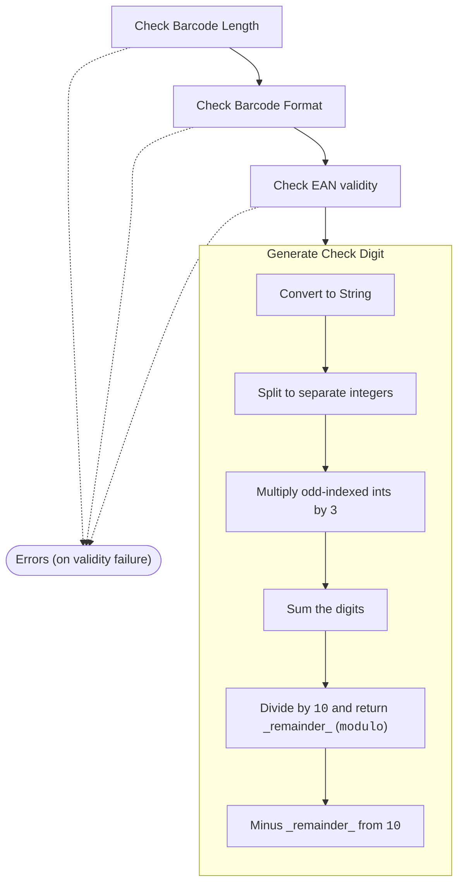

- [ISBN13 Barcode Check Digit Generation](#isbn13-barcode-check-digit-generation)
  - [Implementation](#implementation)
  - [Format](#format)
  - [EAN](#ean)
  - [Process Chart](#process-chart)

# ISBN13 Barcode Check Digit Generation
[Replaced the ISBN10 protocol in 2007](https://en.wikipedia.org/wiki/ISBN#cite_note-conversion-6)

## Implementation
Per the business rules set out in the [spec](https://circlepos.com/jobs/), we're only generating a `check digit` not a `checksum`.

## Format
As the protocol name implies, the barcode is 13 digits long, _including the `check digit`_ (or `checksum` char)

## EAN
The 3-digit prefix for the ISBN13 barcode. Per [Wikipedia](https://en.wikipedia.org/wiki/ISBN#Overview), only `978` & `979` have been made available.

## Process Chart

